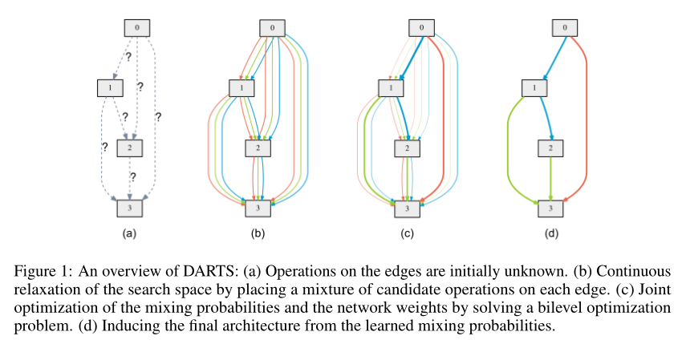
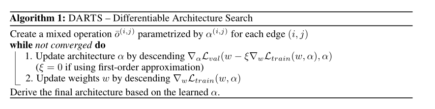
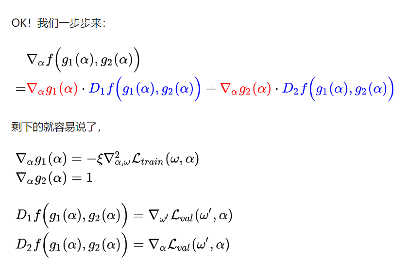
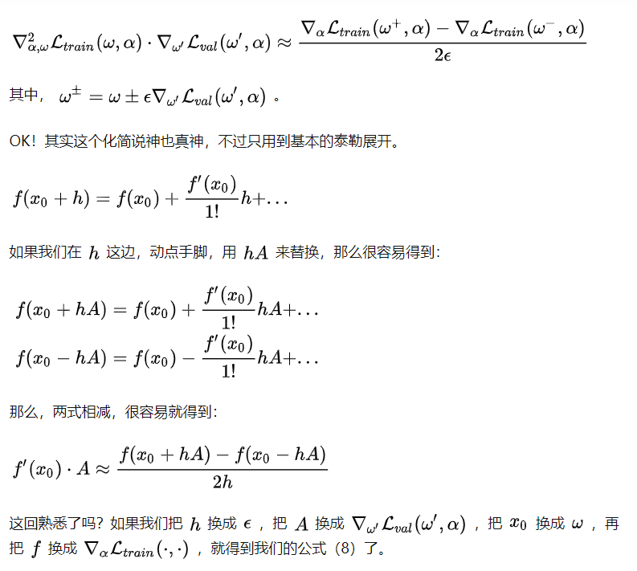

**paper**: https://arxiv.org/abs/1806.09055
**code**: https://github.com/quark0/darts

 

发现最先进的神经网络结构需要人类专家的大量努力。最近，人们对开发算法解决方案以自动化架构设计的手动过程越来越感兴趣。自动搜索的体系结构在图像分类和目标检测等任务中取得了极具竞争力的性能。

传统的$NAS$方法基本上都分为2个步骤：一个是搜索结构（这通常在**验证集val**上进行），一个步骤是在搜索好的结构上做验证（这通常在**训练集train**上进行）。众所周知，如果不是太小的数据集，类似$CIFAR-10$这样的，那第二个步骤还是比较花费时间。这篇文章提出了一种新的松弛方法以解决这个问题。

现有的最佳体系结构搜索算法尽管性能卓越，但计算要求很高。

已经提出了几种加速的方法，例如

1. 强制实施搜索空间的特定结构$（Liu等人，2018b；a）$
2. 每个架构的权重或性能预测$（Brock等人，2018；Baker等人，2018）$
3. 以及跨多个架构的权重共享/继承$（Elsken等人，2017；Pham等人，2018b；Cai等人，2018；Bender等人，2018）$

**但可扩展性的根本挑战仍然存在。主流方法效率低下的一个内在原因是，架构搜索被视为离散域上的黑盒优化问题，这导致需要进行大量架构评估**。

在这项工作中，我们从不同的角度来处理这个问题，**并提出了一种高效的架构搜索方法，称为$DARTS$（可差分架构搜索）。我们没有在一组离散的候选体系结构上进行搜索，而是将搜索空间放宽为连续的，这样就可以通过梯度下降来优化体系结构的验证集性能。**基于梯度的优化的数据效率，与低效的黑盒搜索相反，使$DARTS$能够使用数量级更少的计算资源，实现与最先进水平相竞争的性能。它还优于另一种最近有效的架构搜索方法$ENAS（Pham等人，2018b）$。

虽然之前的工作试图微调架构的特定方面，例如卷积网络中的过滤器形状或分支模式，但$DARTS$能够在丰富的搜索空间中学习具有复杂图形拓扑的高性能架构构建块。此外，$DARTS$不局限于任何特定的体系结构族，并且适用于卷积网络和递归网络。

**$DARTS$实现了显著的效率提高（将架构发现的成本减少到几天$GPU$），这归功于使用基于梯度的优化，而不是不可微搜索技术。(注意：DARTS是可微的！！！)**

## 方法介绍

分为三个部分

1. 有向无环图表示的搜索空间
2. 简单的连续松弛方案，该方案为架构及其权重的联合优化提供了一个可微的学习目标
3. 提出了一种近似技术，使算法在计算上可行且高效

下面展开

***

### 搜索空间

一个$cell$是由$N$个节点的有序序列组成的有向无环图。**每个节点$x^{(i)}$是潜在表示（例如卷积网络中的特征映射），每个有向边$（i，j）$与变换$x^{(i)}$的操作$o^{(i,j)}$相关联。每个中间节点基于其所有前置节点进行计算**：
$$
x^{(j)}=\sum_{i<j}o^{i,j}(x^{(i)})
$$
还包括一个特殊的零操作，以指示两个节点之间缺少连接。因此，学习单元的任务简化为学习其边缘的操作。

### 连续松弛优化

设$O$是一组候选操作（例如卷积、最大池、零），其中每个操作表示要应用于$x^{(i)}$的某个函数$o^{(i,j)}$。为了使搜索空间连续，我们使用$softmax$松弛所有可能的操作：
$$
\bar o^{(i,j)}(x)= \sum_{o \in O} \frac{exp(\alpha_o^{(i,j)})}{\sum_{o' \in O} exp(\alpha_{o'}^{(i,j)})}o(x)
$$
**所以两个节点之间每个操作的权重可以被参数化为一个维度为$|O|$的$\alpha^{(i,j)}$，架构搜索的任务简化为学习一组连续变量$\alpha = \left\{ \alpha^{(i,j)} \right\}$**

 

 

这里我理解是假如在图(b)中要算节点0和节点1之间的$\bar o^{(i,j)}(x)$，假设有三个操作，$softmax$以后对应的比例为$\frac{1}{5}$,$\frac{2}{5}$,$\frac{2}{5}$则
$$
\bar o^{(i,j)}(x) = \frac{1}{5}op1(x) + \frac{2}{5}op2(x) + \frac{2}{5}op3(x)
$$
在搜索结束时，通过替换每个混合操作$\bar o^{(i,j)}(x)$可以获得离散的体系结构,
$$
\bar o^{(i,j)}(x) =  argmax_{o \in O} \alpha_o^{(i,j)}
$$
在下文中，我们将α称为结构的编码。

在进行了$softmax$松弛之后，我们的目标是共同学习所有混合运算中的结构$\alpha$和权重$w$（例如卷积滤波器的权重）。与使用$RL$或$evolution$进行架构搜索类似，DARTS旨在优化验证损失，但使用梯度下降。

定义$L_{train}$和$L_{val}$为训练和验证的损失，这两个损失不仅决定了$\alpha$，还决定了网络中的权重$w$,所有搜索架构的目标就是找到一个$\alpha^*$, 最小化验证损失$\mathcal L_{val}(w^{\star},\alpha^{\star})$其中重量 $w^{\star}$通过最小化训练损失 $\mathcal L_{train}(w,\alpha^{\star})$获得

 

所以这就是一个双向优化的任务：
$$
\min_{\alpha} \ \mathcal L_{val}(w^*(\alpha),\alpha) \\
s.t. \ w^*(\alpha)=argmin_w \ \mathcal L_{train}(w,\alpha)
$$

### 近似架构梯度

由于代价高昂的内部优化，准确评估架构梯度可能会让人望而却步。因此，我们提出一个简单的近似方案如下：
$$
\nabla_{\alpha} \mathcal L_{val}(w^*(\alpha),\alpha) \\
\approx \nabla_{\alpha} \mathcal L_{val}(w- \xi\nabla_{w}\mathcal L_{train}(w,\alpha),\alpha)
$$
其中$w$是当前的权重，$\xi$是内部优化的学习率，这个优化 $w^*(\alpha)$的想法是使用单步优化，而不是通过训练直到收敛来解决内部优化，如果 $w$已经是内部最优，则$\nabla_{w}\mathcal L_{train}(w,\alpha)=0$

~~~
相关技术已用于模型转移的元学习（Finn等人，2017年）、基于梯度的超参数调整（Luketina等人，2016年）和展开的生成性对抗网络（Metz等人，2017年）
~~~

 

**接下来就是本文最大的贡献和亮点：**

说了这么一大堆，其实就是为了引出下面2个公式。首先，作者是说使用$chain \ rule$(链式法则)可以将上面近似后的式子化简为：
$$
\nabla_{\alpha} \mathcal L_{val}(w- \xi\nabla_{w}\mathcal L_{train}(w,\alpha),\alpha) = \nabla_{\alpha} \mathcal L_{val}(w',\alpha)- \xi\nabla_{\alpha,w}^2\mathcal L_{train}(w,\alpha) \cdot \nabla_{w'}\mathcal L_{val}(w',\alpha)
$$
看着复杂，其实就是一个关于 $\alpha$的复合函数求导，其实就是可以看作 $\nabla_{\alpha} f(g_1(\alpha),g_2(\alpha))$，其中 $f(\cdot,\cdot)=\mathcal L_{val}(\cdot,\cdot)$， $g_1(\alpha)=w- \xi\nabla_{w}\mathcal L_{train}(w,\alpha)$，$g_2(\alpha)=\alpha$

 

 

这里的$D_1f(g_1(\alpha),g_2(\alpha))$就是 $f(g_1(\alpha),g_2(\alpha))$对 $g_1(\alpha)$求导，这里的 $w'$就表示的 $w- \xi\nabla_{w}\mathcal L_{train}(w,\alpha)$这个整体，$D_2f(g_1(\alpha),g_2(\alpha))$同理

将上面的四项带入到 $\nabla_{\alpha} \mathcal L_{val}(w- \xi\nabla_{w}\mathcal L_{train}(w,\alpha),\alpha)$当中就可以得到上式的后面部分了

当然还要计算最后两项的乘积即 $\xi\nabla_{\alpha,w}^2\mathcal L_{train}(w,\alpha) \cdot \nabla_{w'}\mathcal L_{val}(w',\alpha)$，该如何计算呢？要用到一阶的泰勒公式展开

 

 

当 $\xi=0$时，$\xi\nabla_{w}\mathcal L_{train}(w,\alpha)$将消失。在这种情况下，架构梯度由以下公式给出$\nabla_{\alpha} \mathcal L_{val}(w,\alpha)$，对应于通过假设当前$w$与$w^*(\alpha)$相同来优化验证损失的简单方式，这样虽然可以加速，但是性能会差。

我们引用$\xi=0$的情况作为一阶近似，引用$\xi >0$的梯度公式作为二阶近似。

***

## 总结

1. **其实主要思想就是搜索空间的定义和联合的训练架构参数$\alpha$和操作参数$w$，公式的推导也透彻了，但是对具体的实现还是存疑，不知道到底是怎么样的优化过程，明天专门看代码分析一下实现过程。**
2. **这篇文章其实看过两次了，但是没有做好总结，教训**
