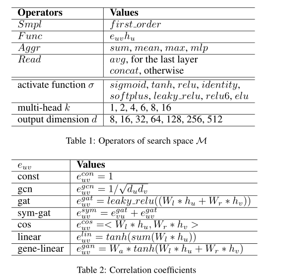
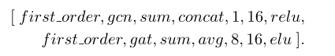
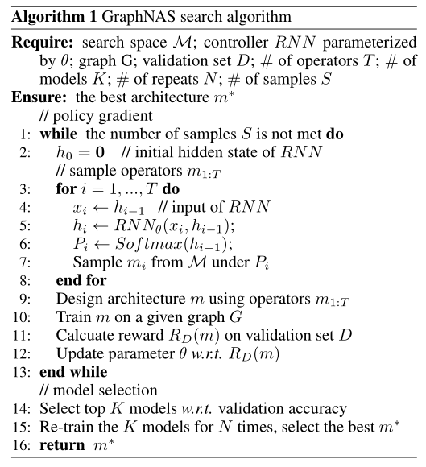
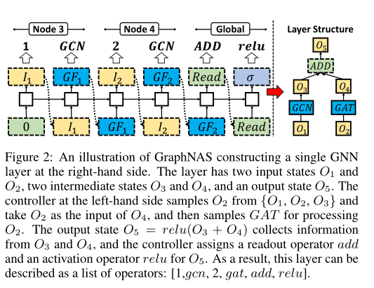
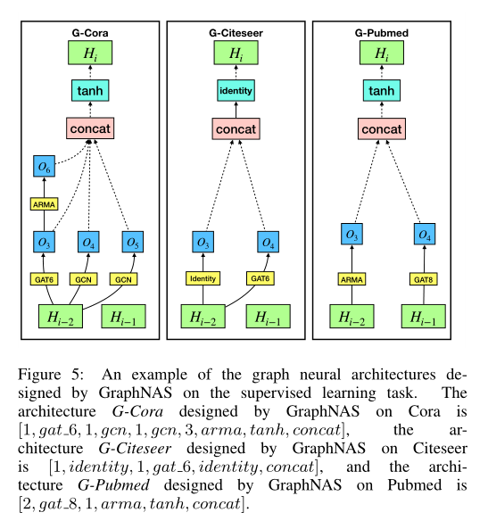

**paper**:https://www.ijcai.org/proceedings/2020/195

## 背景及动机

图形神经网络的设计需要大量的手工工作和领域知识。在本文中，我们提出了一种图神经结构搜索方法（GraphNAS），该方法能够基于强化学习自动设计最佳的图神经结构。

GraphNAS**使用递归网络生成描述图神经网络结构的可变长度字符串，并使用策略梯度训练递归网络，以最大限度地提高在验证数据集上生成的结构的预期精度。此外，为了提高GraphNAS在大型网络上的搜索效率，GraphNAS将搜索空间从整个架构空间限制为在每个架构层上构建的最佳搜索结果的顺序串联。**

### **搜索空间** 

四个部分

1. 邻域采样算子
2. 消息计算运算符
3. 消息聚合运算符
4. 多头和readout运算符

例如，考虑具有两层的GNN。第一层由16个隐藏单元的GCN和一个激活函数relu组成。第二层由八个头、16个隐藏单元和激活函数elu组成。然后，通过连接两层的运算符来描述架构，这形成了一个更长的运算符列表，如下所示：

由于表1中给出的搜索空间M中的所有运算符都是独立的，因此M中将有$9408^L$个组合，其中$L$是层数。由于搜索空间太大，我们在实验中将$L$设置为只有两层，这将空间减少到$8.8×10^7$。如果架构深度超过两层，则可能的解决方案是设置一个时间敏感参数来控制搜索空间中的总搜索时间。

 

**搜索策略**

 

其实就是以RNN的方式选择操作方法，每生成一个方案就在验证集上计算准确率，从方案中再挑选出K个之后再训练N次，选出最好的架构。

图形的搜索空间随层数呈指数增长。当架构深入时，通过连接运算符来构建架构将导致搜索空间爆炸。**为了解决这个问题，我们实施了三个约束，以避免搜索空间的指数增长。首先，我们假设层是独立的，并独立设计每个层。其次，我们使用现有GNN架构的领域知识，并减少表1中给出的运算符组合的数量。第三，我们允许多头机制使用不同的消息计算运算符。**

举个例子，图示为在右侧构建单个$GNN$层。该层具有两个输入状态$O1$和$O2$、两个中间状态$O3$和$O4$以及一个输出状态$O5$。左侧的控制器从${O1，O2，O3}$中采样$O2$，并将$O2$作为$O4$的输入，然后采样$GAT$以处理$O2$。输出状态$O5=relu(O_3+O_4)$从$O3$和$O4$收集信息，控制器为$O_5$分配读出运算符$add$和激活运算符$relu$。因此，该层可以描述为运算符列表：$[1，gcn，2，gat，add，relu]$。

后面这里稍微有点不理解，估计要看代码实现才能明白，对$RNN$这里貌似一直有点疑惑没有解开

