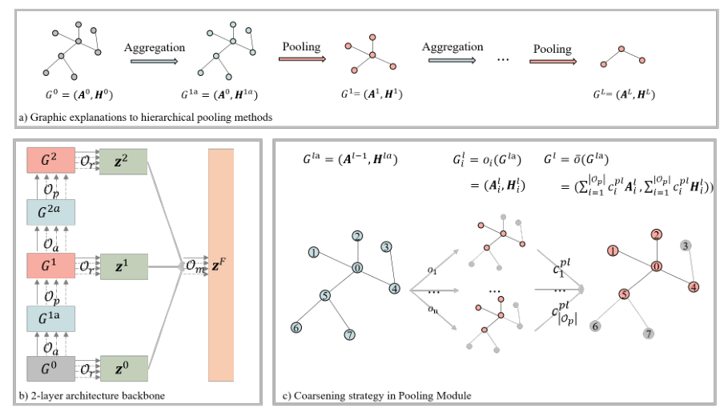
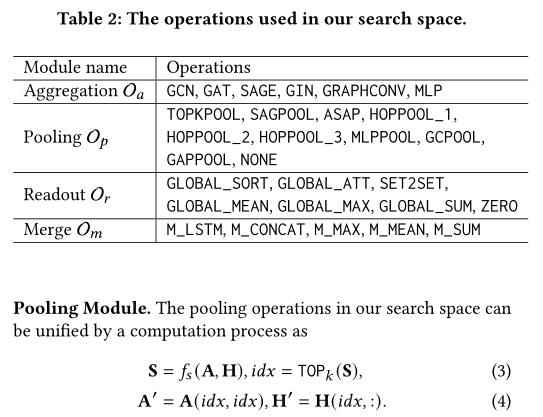
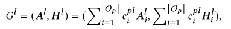
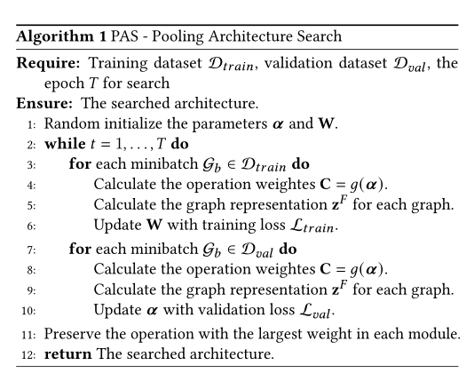

**paper**:https://arxiv.org/pdf/2108.10587.pdf

## 背景和动机

GNN被设计为基于邻域聚合方案学习节点级表示，并为了获得图级表示，在现有GNN模型中的聚合操作后应用池方法来生成粗粒度图。然而，由于图分类的应用高度多样化，并且现有的池方法的性能在不同的图上有所不同。换句话说，设计一个通用的池体系结构以在大多数情况下表现良好是一个具有挑战性的问题，这导致在现实应用中需要特定于数据的池方法。

大多数用于GNN的现有NAS方法都侧重于聚合函数，并且在处理图级任务时，仅在搜索的体系结构上使用全局池函数。因此，它们也无法获得特定于数据的池架构。设计用于池体系结构搜索的NAS方法很重要，因为全局和分层池方法在不同的场景中都是有效的。任何NAS方法都需要考虑这两种池范式。此外，在将NAS应用于设计特定于数据的池体系结构时，还需要考虑搜索效率。

1. 提出了一个统一的池框架，该框架由四个关键的图分类模块组成，涵盖了全局和分层池方法
2. 基于统一框架，设计了一个定制的有效搜索空间。
3. 为了在搜索空间的顶部进行高效搜索，可以采用可微搜索算法，该算法通过混合所有候选操作的输出，将离散搜索空间松弛为连续搜索空间。
4. 由于搜索空间中的不同候选池操作会生成由不同节点和边组成的不同粗图，因此不可能像现有的可微搜索方法（如DART和SNAS）那样直接松弛设计的搜索空间。为了应对这一挑战，我们设计了一种粗化策略，以适当地连续放松池操作的选择，然后开发一种可微搜索方法来完成搜索过程。最后，当搜索过程终止时，我们提取最优架构。

在池化层的融合策略上，因为不同的pooling对应出来的图都不一样，无法聚合，所以解决的方法就是保留形状，把不同的子图加在一起，这样就可以搜索了

其实这篇论文就是提出了一个简单的搜索空间和对池化层的一个统一格式的操作，很容易理解

