**paper**:

1. https://arxiv.org/abs/1301.3781
   explain: [word2vec](https://so.csdn.net/so/search?q=word2vec&spm=1001.2101.3001.7020)的奠基性论文之一，由Google的Tomas Mikolov提出。该论文提出了CBOW和Skip-gram两种word2vec模型结构。
2. https://proceedings.neurips.cc/paper/2013/hash/9aa42b31882ec039965f3c4923ce901b-Abstract.html
   explain: word2vec的另一篇奠基性论文。详细描述了Skip-gram模型，包括模型的具体形式和Hierarchical Softmax、Negative Sampling两种可行的训练方法。

# 词表征

1.  $one-hot$ 表征(很难表达相似度)
   1. 维度太大
   2. 每个元素是离散的的，要不就是0，要不就是1
   3. $local$ 只有一位起决定作用
2. 分布式表示
   1. 维度相对较低 $d \ll \left|V\right|$
   2. 每个元素不再是离散的，可以是不同的实数
   3. 并不是只有一位起作用，联合表达一个单词

Word2vec就是一种分布式表示的方法

# Word2vec

Training Data: corpus
$$
[\omega_1,\omega_2,\cdots,\omega_{t-1},\omega_t,\omega_{t+1},\cdots,\omega_T]
$$
Target: 词的分布式表示

***

**接下来的分析过程是基于$skip-gram$,会提到三个假设：**

首先我们来看联合概率分布，联合概率表示为包含多个条件并且所有的条件都同时成立的概率，记作 $P(X=a,Y=b)$或 $P(a,b)$，有的书上也习惯记作$P(ab)$,**利用深度学习拟合的就是这种概率分布。**根据公式$P(X,Y)=P(X|Y)\times P(Y)$,我们从词库中随便选择一个词，那么整个词库的概率表示应该如下所示，**因为后面的计算会很复杂，这里为了方便计算，$\triangle$表示假设窗口大小是2C**
$$
P(\omega_{1:T})= P(\omega_t) \cdot P(context(\omega_t)|\omega_t)\triangleq P(\omega_t) \cdot P(\omega_{t-c:t-1},\omega_{t+1:t+c}|\omega_t)
$$

~~~
补充：“似然性”和“概率”（或然性）有明确的区分：概率，用于在已知一些参数的情况下，预测接下来在观测上所得到的结果；似然性，则是用于在已知某些观测所得到的结果时，对有关事物之性质的参数进行估值，也就是说已观察到某事件后，对相关母数进行猜测。
~~~

**似然函数（**英语：$likelihood function$）是一种关于[统计模型](https://zh.m.wikipedia.org/wiki/统计模型)中的[参数](https://zh.m.wikipedia.org/wiki/母數)的[函数](https://zh.m.wikipedia.org/wiki/函数)，表示模型参数中的**似然性**

所以我们从上式可以写出$likelihood$：
$$
P(\omega_t) \cdot P(\omega_{t-c:t-1},\omega_{t+1:t+c}|\omega_t)
$$
又因为我们不太关注$P(\omega_t)$,因为是随机取的，而且可以取遍整个词表，有$T$个，所以我们更关注后面的条件概率

所以$conditional \ likelihood$可以表示为:
$$
\prod_{t=1}^{T}P(\omega_{t-c:t-1},\omega_{t+1:t+c}|\omega_t)
$$
 **这里假设每个条件概率之间是相互独立的**

为了化简，采用$\log$，则$average \ conditional \ likelihood$可以如下图表示：
$$
\frac{1}{T} \sum_{t=1}^{T}\log P(\omega_{t-c:t-1},\omega_{t+1:t+c}|\omega_t)
$$
**这里做第三个假设，假设内部$P(\omega_{t+i}|\omega_t)$是独立同分布的**

于是继续化简上式为
$$
\frac{1}{T} \sum_{t=1}^{T}\log \prod_{i \in[-c,0) \cup (0,c]  }P(\omega_{t+i}|\omega_t) =  \frac{1}{T} \sum_{t=1}^{T} \sum_{i \in[-c,0) \cup (0,c]  } \log P(\omega_{t+i}|\omega_t)
$$
到现在可以看出只要关注给定一个中心词，该中心词窗口内其他词的概率就可以，**注意，这里窗口内的词都是独立的，不存在顺序问题(比如要先出现$\omega_{t}$再出现$\omega_{t+1}$)，这样的表示已经忽略了次序，这里都是独立的。**

***

**当然，从上面的分析我们暂时看不出来和求词表分布式表示有啥关系？接下来我们探索这个问题**

首先我们从输入输出和模型的角度来分析，先看下面这张图

 

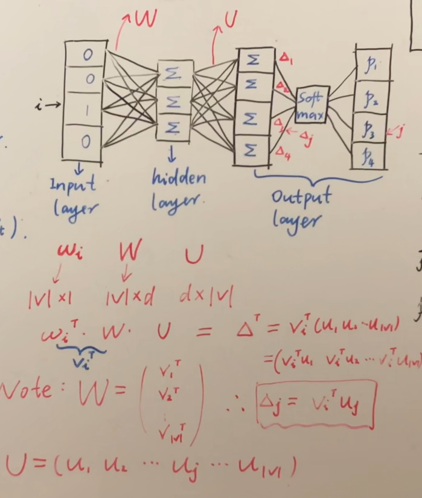

 

首先我们选取一个中心词$\omega_i$，用$one-hot$的表示输入的话则是一个$\mathbb R^{|V| \times 1}$的向量，其中$|V|$是词表中所有单词的数量，这个向量只有在第$i$位是1，其他位全都为0。参数矩阵$W \in \mathbb R^{|V| \times d}$和$U \in \mathbb R^{d \times |V|} $，**注意这里的$W$矩阵没有使用激活层，是线性的，为了计算简单，如果用矩阵相乘的方式，那么用$\mathbb R^{|V| \times 1}$的向量转置以后得到的$\mathbb R^{ 1 \times |V| }$向量作为输入，在模型的输出也会得到一个$\mathbb R^{ 1 \times |V| }$的向量**，这里我们要特别理解模型的输出代表什么，如下所示：
$$
\mathbb R^{ 1 \times |V| } \stackrel{每一位的表示}\longrightarrow \left\{ P(\omega_1|\omega_i),P(\omega_2|\omega_i),P(\omega_3|\omega_i),\cdots,P(\omega_{|V|}|\omega_i)\right\}
$$
然后使用softmax将所有概率值放在$(0，1]$区间当中，即对于中心词$\omega_{i}$，所预测的其他所有词的概率，令$softmax$之后的值为，
$$
\left\{ \hat P(\omega_1|\omega_i),\hat P(\omega_2|\omega_i),\hat P(\omega_3|\omega_i),\cdots,\hat P(\omega_{|V|}|\omega_i)\right\}
$$
对于中心词$\omega_{i}$，所预测的其他所有词的概率之和为1：
$$
\sum_{t=1}^{|V|} \hat P(\omega_t|\omega_i)=1
$$
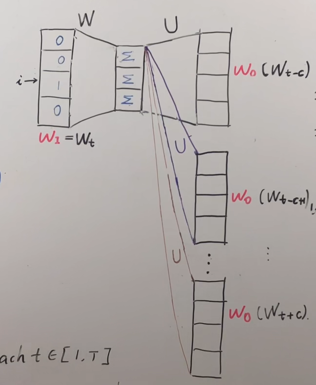

 

当然我们需要在$\omega_{i}$长度为$2c$的窗口中每个上下文一个位置所有的概率值，注意下图对应的$W^{'}$参数矩阵就是上图的$U$矩阵(注意，不是多个不同的U矩阵，都是同一个，这里为了形象化不同的上下文位置拆开了)，这里我理解假如一共有5个词，s上下文窗口有两个词对应的索引分别式1和3，则所代表的$\hat y_{target}=[0,1,0,1,0]$，在损失函数优化的时候应该用$\hat y_{target}-y_{output}$合在一起算，下面的分开算只是为了好理解，其前面的c个词和后面的c个词作为了$Skip-Gram$模型的输出,，期望这些词的$softmax$概率比其他的词大。

 

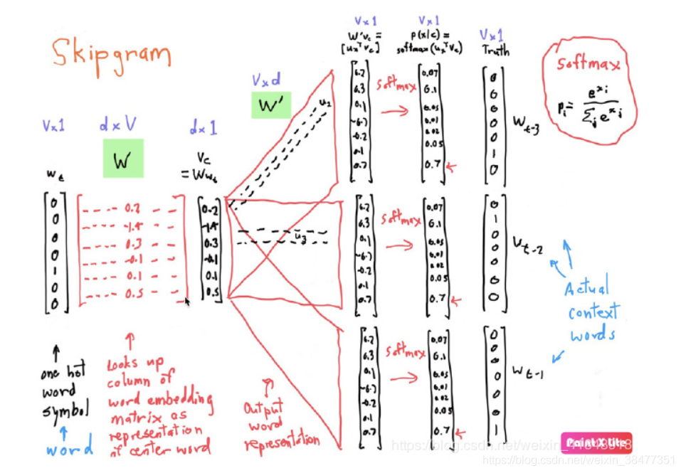

 

最后我们讨论损失函数，我们已经有了上面的似然函数，则损失函数的优化可以如下表示，因为我们要最大化中心词和上下文之间的联系概率，所以要
$$
\max \frac{1}{T} \sum_{t=1}^{T} \sum_{i \in[-c,0) \cup (0,c]  } \log P(\omega_{t+i}|\omega_t)
$$
对上式我们取负数，则变成了最小化：
$$
\min -\frac{1}{T} \sum_{t=1}^{T} \sum_{i \in[-c,0) \cup (0,c]  } \log P(\omega_{t+i}|\omega_t)
$$
所以损失函数即为：
$$
J(\theta)=-\frac{1}{T} \sum_{t=1}^{T} \sum_{i \in[-c,0) \cup (0,c]  } \log P(\omega_{t+i}|\omega_t)
$$
**那最后该怎么得到所有词的向量呢？我们在训练的过程中不断的更新$W$和$U$的参数矩阵，在训练完成之后，用$one-hot$向量和训练好的$W$矩阵相乘就是得到的词向量了，也就是词的embedding！！！（注意，不需要$U$矩阵）**

最后

**这里skip-gram的介绍就完成了，CBOW的思想类似**

# 两个优化方法

## Hierarchical Softmax

**思考：如果词库特别大，也就是$|V|$特别大，那在最后计算$softmax$的计算量也会非常大，怎么办呢？**

该方法最后一层的长度不设置成$|V|$大小，而是设置成一棵树的节点数的长度，这里首先要了解$Huffman$树的构造方法和$Huffman$编码。

**这里看这个图，非常容易理解，按照词频进行节点的融合，越靠近根节点的词频越大，黄色节点是在构成树的过程当中添加的节点，注意，所有词都在叶子节点上，但非叶子节点上也要定义和叶子节点等长的向量，为了方便计算**

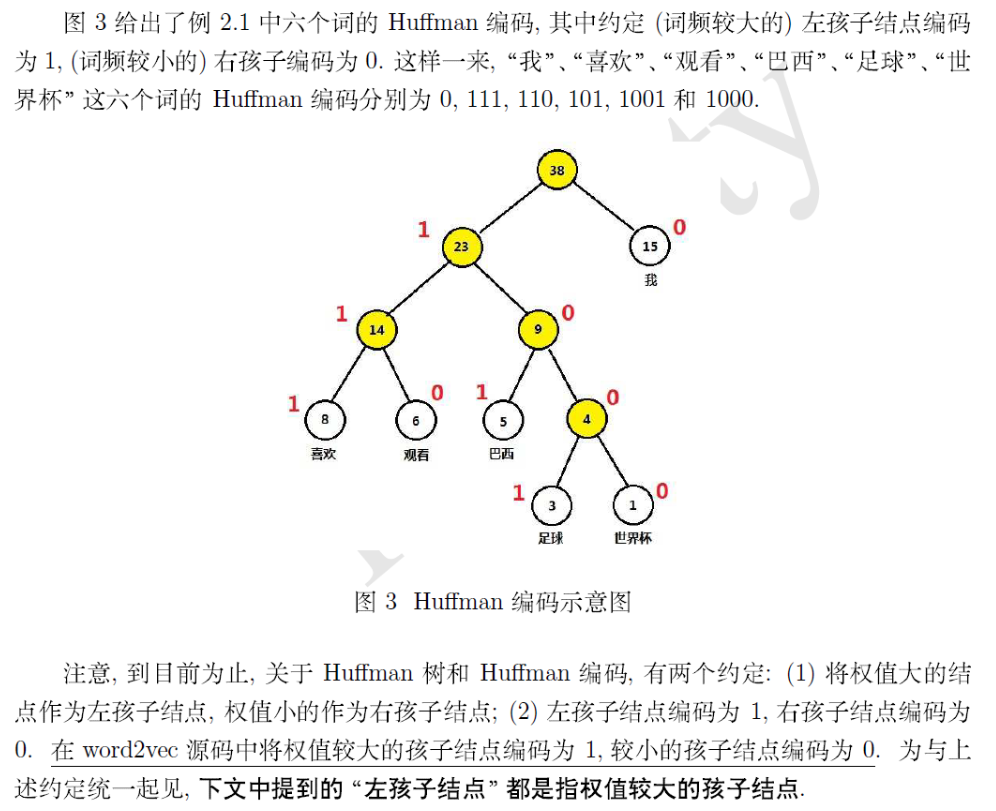

 

**$CBOW$**

 

在得到了上面的图之后，我们就可以来计算概率，首先以$CBOW$为例子，将输入层的$2c$个词向量累加求和，即
$$
X_w=\sum_{i=1}^{2c}v(context(w_i)) \quad v(context(w_i)\in \mathbb R^{m}
$$
 **这里一定要注意，一开始死活不明白为什么用二分类乘积的方法就可以计算$w$在其上下文的条件概率，就是因为忽略了这里，其实$X_w$在二分类中已经被当作条件使用了，太蠢了，这点无知错误都没想明白**

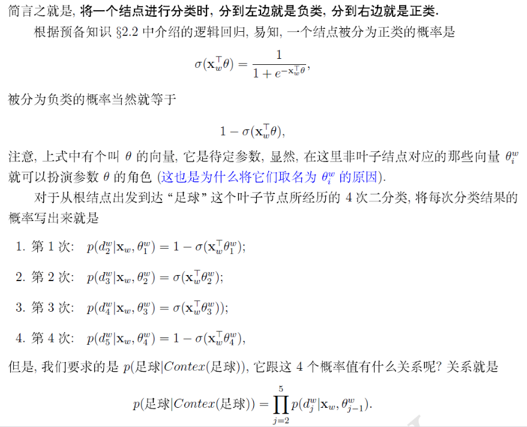

 

**在得到了一个词在其上下文的概率之后，就可以扩展到整个词库，从而得到损失函数，采用随机梯度上升法将这个函数最大化。**

 

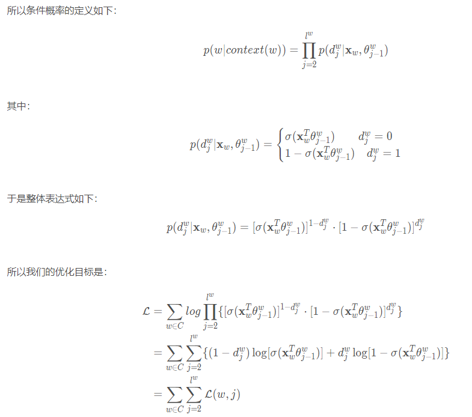

 

**$Skip-gram$**

 

讲完了$CBOW$，其实$Skip-gram$的思想一模一样，就是反过来了,之前的$CBOW$是根据上下文预测中间词，而$Skip-gram$是根据中间词预测上下文，即有了$X_w$来得到$p(context(w)|w)$，根据这个思想得到优化函数，其实就是要对$context(w)$的所有词概率进行相乘，和$CBOW$是反的，可以理解为一个是多对一，一个是一对多，但本质上都是为了让$w$和$context(w)$联系的更加紧密

 

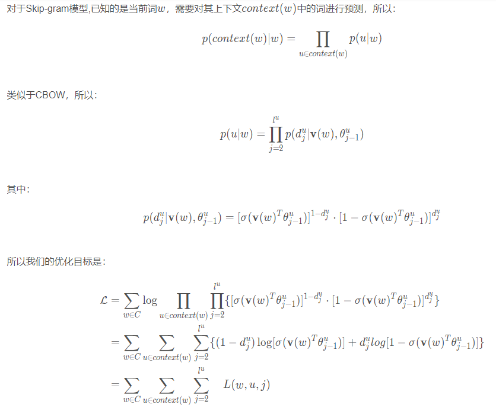

 

同样，采用随机梯度上升法将这个函数最大化。

***

## Negative Sampling

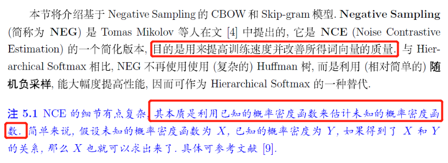

 

**$CBOW$**

 

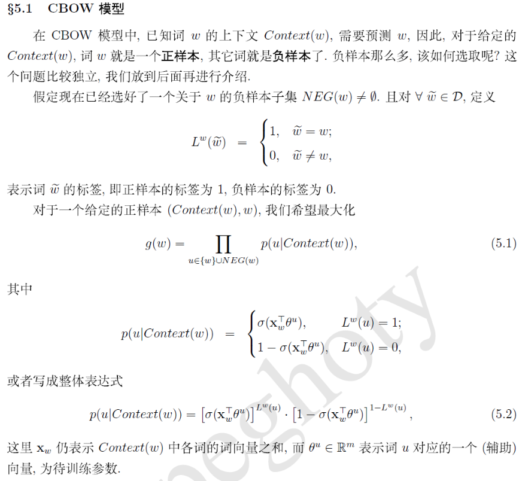

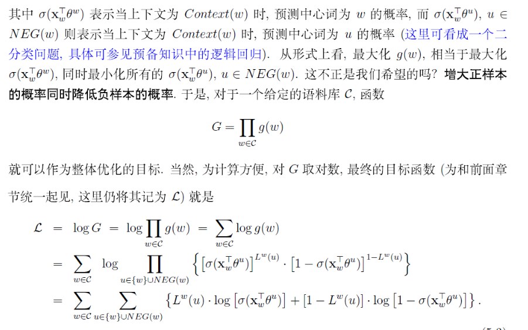

 

**$Skip-gram$**

 

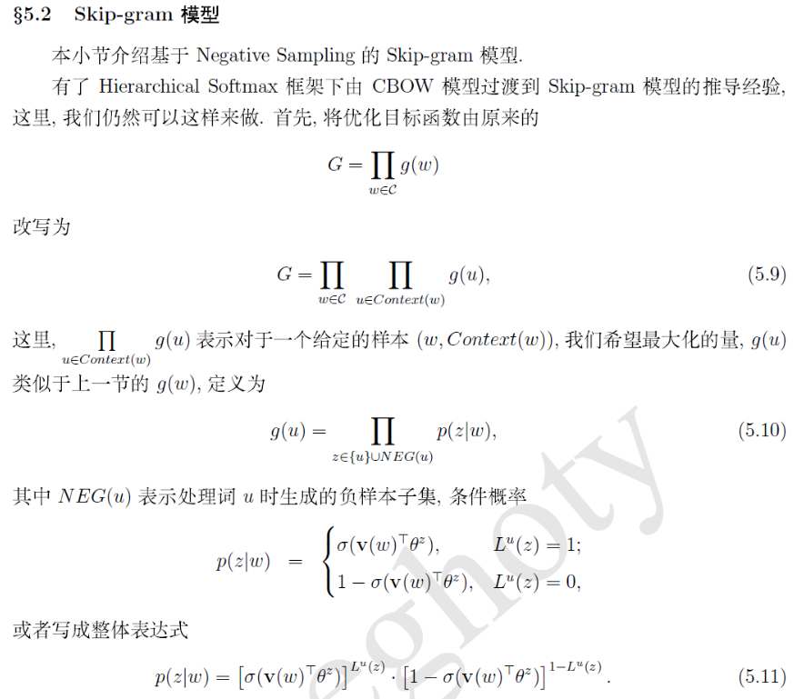

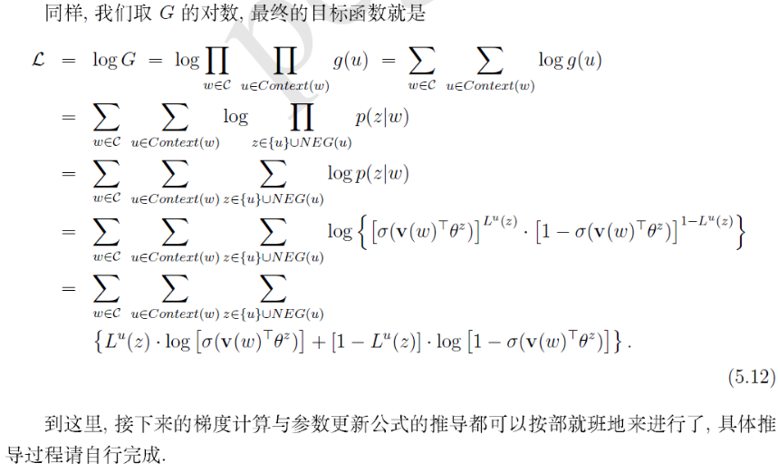

 

**如何负采样**

 

上面个介绍了CBOW和skip-gram的负采样方法，那刚才的遗留问题，究竟怎样负采样呢？

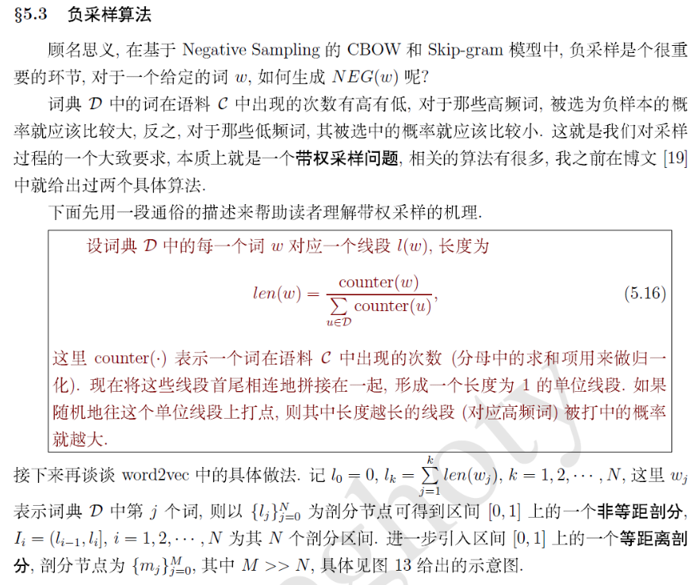

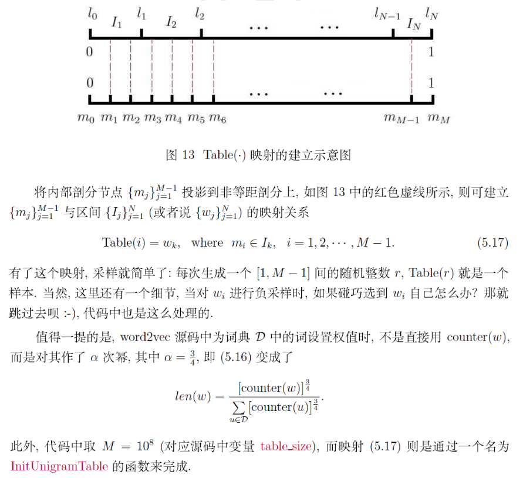

 

参考资料：

1. https://www.cnblogs.com/peghoty/p/3857839.html

2. https://blog.csdn.net/VariableX/article/details/106531987

3. https://www.bilibili.com/video/BV1hy4y1n7ik?p=3&spm_id_from=pageDriver

   explain:白板推导系列很不错

***

## 总结

**这一次下了比较大的功夫，终于对word2vec有一个比较深入的理解了，之前总是看了一知半解，不够认真，学东西的时候一定更沉下心，要不就是在浪费时间，原理明白了，但是对代码的实现还差的很远，继续加油吧。**

